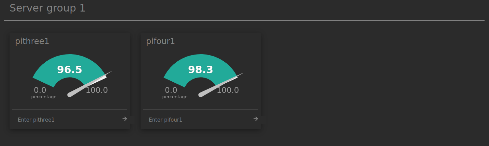

# NetBoard
[](https://www.codefactor.io/repository/github/satcom886/netboard)  
This should one day be a multiserver dashboard for Netdata. I'm hoping for this to read a config file where the user would define **groups** of **servers** and the website would add a card for each server (kinda like [Homer](https://github.com/bastienwirtz/homer) does). In fact the entire concept should look very similar to Homer.  

Once you install this, it should look like this:  


# Modifying the dashboard
In the future this shouldn't be needed, but for now you actually have to edit the HTML in order to get your servers onto the dashboard. I won't explain the process here, there are comments in the source code to guide you.

## The general look
The theme should be pretty similar to the normal Netdata dashboard.  
Servers should be in "cards" or "tiles", each tile having a name as the heading, CPU meter, possibly a graph and a button saying "Enter [name of the server]".  
Groups are separated by a heading and a bit of a space.  

This is the look I'm going for. The categories would be the groups and the individual items would be the servers.  
  
I'd really like to avoid much server-side setup, so ideally this would be in JS instead of PHP.  

the python pseudo-code for this (please forgive me)
```python
for group in groups:
    print(group w3-h2)
    for server in servers:
        print(w3-card)
        print(server w3-h3)
        chart()
        button()
```
hey... this doesn't look that difficult...