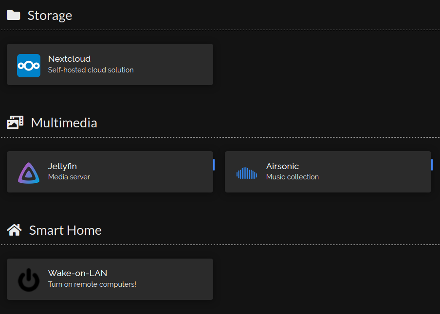

# NetBoard
This should one day be a multiserver dashboard for Netdata. I'm hoping for this to read a config file where the user would define **groups** of **servers** and the website would add a card for each server (kinda like [Homer](https://github.com/bastienwirtz/homer) does). In fact the entire concept should look very similar to Homer. I'll ad an image to show what I mean.  
A group should have:
 * A name (e.g. compute servers) - this would be the biggest heading
 * Servers inside  

Each server should have:
 * A name (heading #2)
 * An address (only used for gathering data and for the "Go to" button)

## The general look
The theme should be pretty similar to the normal Netdata dashboard.  
Servers should be in "cards" or "tiles", each tile having a name as the heading, CPU meter, possibly a graph and a button saying "Enter [name of the server]" or just clicking on the name would take you to that server.  
Groups are separated by a heading and a bit of a space.  

This is the look I'm going for. The categories would be the groups and the individual items would be the servers.  
  
I'd really like to avoid much server-side setup, so ideally this would be in JS instead of PHP.